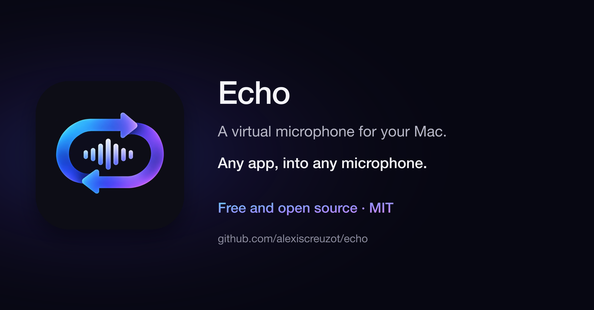
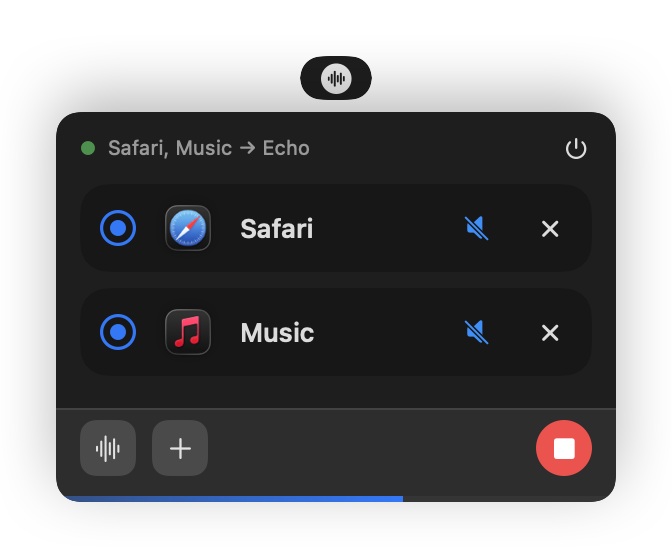

# Echo

<p align="center">
  
</p>

<p align="center">
  
</p>

<p align="center">
  <strong>A virtual microphone for your Mac.</strong><br>
  Send audio from any app into any app that takes a mic.
</p>

<p align="center">
  <a href="https://developer.apple.com/macos/"></a>
  <a href="LICENSE"></a>
</p>

Echo adds a microphone to your Mac that plays sound from the apps you choose. Pick Safari, Music, or an audio file in the menu bar, press play, and anything that listens to a microphone can hear it — the iOS Simulator, a call, a recording, a browser tab.

Your apps keep playing normally. Echo just gives them somewhere new to be heard.

## Install

macOS 26 or later.

```bash
brew tap alexiscreuzot/echo https://github.com/alexiscreuzot/echo
brew trust alexiscreuzot/echo
brew install --cask echo
```

The first time you open Echo, macOS asks for an administrator password so it can add the Echo microphone.

<details>
<summary>Already using Echo from an older tap?</summary>

```bash
brew tap --custom-remote alexiscreuzot/echo https://github.com/alexiscreuzot/echo
brew update
brew upgrade --cask echo
```

</details>

## Use it

1. Click the waveform icon in the menu bar.
2. Add an app, or an audio file.
3. Press play. macOS may ask once per app for permission to capture its sound.
4. In the app that should listen, choose **Echo** as the microphone. In the iOS Simulator that’s **I/O → Audio Input → Echo**.

Echo remembers your sources. When that app is open again, it shows as active.

## How it works

- **Echo.driver** — a Core Audio HAL plugin that creates the Echo microphone. It’s a 2-channel, 48 kHz device: audio written to its output is readable on its input.
- **Echo.app** — the menu bar app. It taps the apps you add (Core Audio process taps), mixes them, and plays the result into Echo.

## Remove it

```bash
brew uninstall --cask echo
sudo rm -rf /Library/Audio/Plug-Ins/HAL/Echo.driver
sudo killall coreaudiod
```

The last two lines remove the Echo microphone. After that, it no longer appears in the Simulator or Audio MIDI Setup.

## Developers

Build the **Echo** scheme in `Echo.xcodeproj`. First launch installs the bundled audio driver.

A Debug build from Xcode will not show up as a microphone — Core Audio only loads a driver signed with a Developer ID certificate. Archive, then **Direct Distribution**, and notarize. Details are in [CONTRIBUTING.md](CONTRIBUTING.md).

```bash
./scripts/install-driver.sh /path/to/Echo.driver
```

## License

[MIT](LICENSE). By contributing you agree to the [Code of Conduct](CODE_OF_CONDUCT.md).
